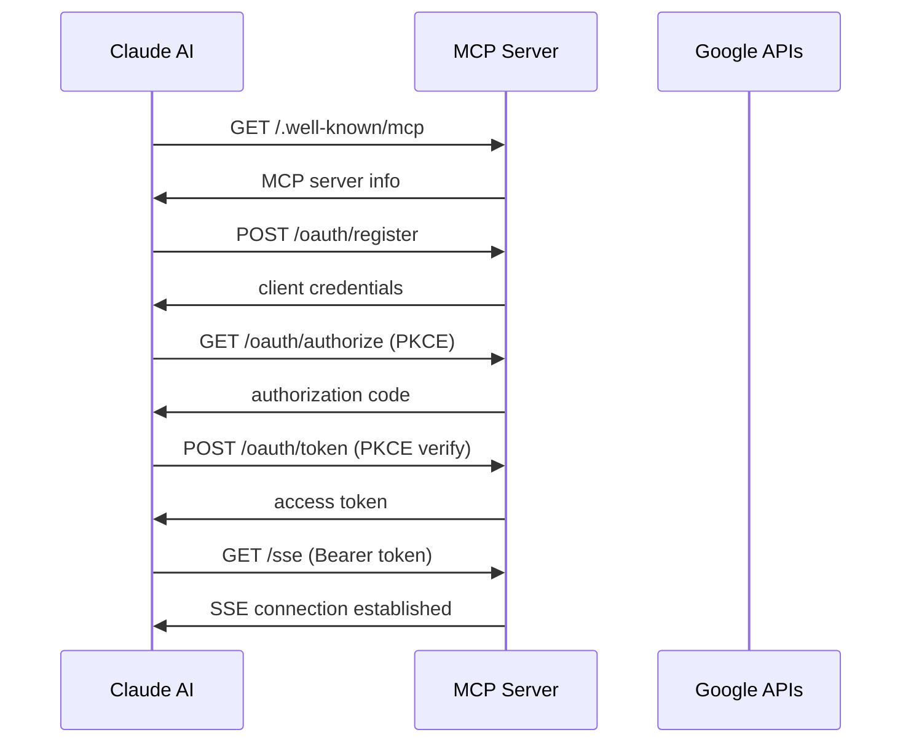
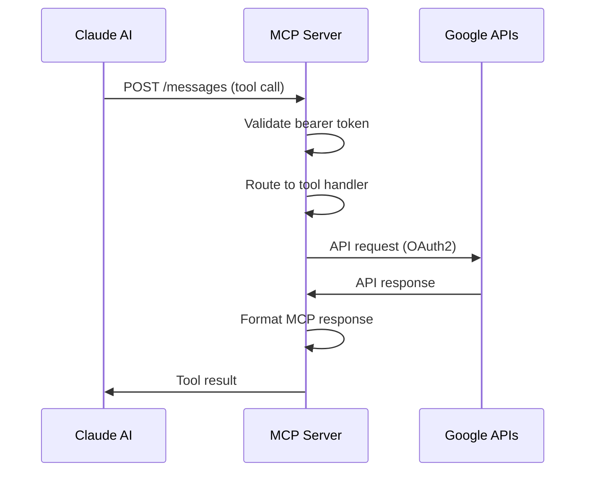

# Google Task Calendar Remote MCP Server - Product Requirements Document

## 1. Project Overview

### Project Name
Google Task Calendar Remote MCP Server

### Objective
Convert existing local Google Task Calendar MCP server to remote MCP server with full Claude AI integration compatibility while maintaining all current functionality.

### Success Criteria
- ✅ Preserve all 10 existing tools (5 Google Tasks + 5 Google Calendar)
- ✅ Claude AI remote integration working on all devices
- ✅ 24/7 availability via Synology NAS deployment
- ✅ Secure authentication and access control
- ✅ Performance comparable to local MCP server

## 2. Current System Analysis

### Source Implementation
- **Repository**: Enhanced fork of https://github.com/zcaceres/gtasks-mcp
- **Location**: `C:\Users\hklee\source\mcp-servers\google-task-calendar`
- **Version**: Custom v0.2.0 with Google Calendar integration
- **Architecture**: MCP SDK v0.6.0 + StdioServerTransport
- **Dependencies**: googleapis v149.0.0, axios v1.9.0

### Current Tools Inventory
**Google Tasks Tools (5):**
1. `list_task_lists` - List all Google Task lists
2. `list_tasks` - List tasks within specific list
3. `add_task` - Add new task to list
4. `update_task` - Update existing task (title/notes/status)
5. `delete_task` - Delete task from list

**Google Calendar Tools (5):**
1. `list_calendars` - List all Google Calendars
2. `list_events` - List events from calendar (with filters)
3. `create_event` - Create new calendar event
4. `update_event` - Update existing event
5. `delete_event` - Delete event from calendar

### Authentication Model
- **Current**: Pre-configured OAuth2 refresh token
- **Credentials**: GOOGLE_CLIENT_ID, GOOGLE_CLIENT_SECRET, GOOGLE_REFRESH_TOKEN
- **Scope**: Personal use only with user's Google account

## 3. Functional Requirements

### FR1: Transport Protocol Conversion
- **FR1.1**: Replace StdioServerTransport with SSE (Server-Sent Events) transport
- **FR1.2**: Implement HTTP endpoints for Claude AI compatibility
- **FR1.3**: Maintain backward compatibility with local MCP access if needed

### FR2: OAuth 2.1 Compliance for Claude AI
- **FR2.1**: Implement required OAuth discovery endpoints:
  - `/.well-known/oauth-authorization-server`
  - `/.well-known/mcp`
- **FR2.2**: Support dynamic client registration (Claude AI)
- **FR2.3**: PKCE (Proof Key for Code Exchange) support
- **FR2.4**: Token validation and session management

### FR3: MCP Endpoint Implementation
- **FR3.1**: Root endpoint `/` with server discovery info
- **FR3.2**: Health check endpoint `/health`
- **FR3.3**: SSE endpoint `/sse` for real-time communication
- **FR3.4**: Messages endpoint `/messages` for Claude AI requests
- **FR3.5**: Proper CORS configuration for Claude AI access

### FR4: Tool Functionality Preservation
- **FR4.1**: All 10 tools must work identically to local version
- **FR4.2**: Google API integration unchanged
- **FR4.3**: Error handling and response formats preserved
- **FR4.4**: Input validation maintained

### FR5: Docker Deployment
- **FR5.1**: Production-ready Dockerfile
- **FR5.2**: Docker Compose configuration for NAS deployment
- **FR5.3**: Environment variable management
- **FR5.4**: Health checks and restart policies
- **FR5.5**: Non-root container execution for security

## 4. Non-Functional Requirements

### NFR1: Performance
- **NFR1.1**: Response time < 2 seconds per tool operation
- **NFR1.2**: Memory usage < 256MB under normal load
- **NFR1.3**: CPU usage < 10% on Synology NAS
- **NFR1.4**: Concurrent connection support (5+ simultaneous)

### NFR2: Security
- **NFR2.1**: HTTPS-only communication via Cloudflare tunnel
- **NFR2.2**: Secure environment variable handling
- **NFR2.3**: No hardcoded credentials in container
- **NFR2.4**: OAuth token validation for all requests
- **NFR2.5**: Rate limiting protection

### NFR3: Reliability
- **NFR3.1**: 99.9% uptime (excluding planned maintenance)
- **NFR3.2**: Automatic container restart on failure
- **NFR3.3**: Graceful error handling for Google API failures
- **NFR3.4**: Connection retry logic with exponential backoff

### NFR4: Scalability
- **NFR4.1**: Support multiple Claude AI clients simultaneously
- **NFR4.2**: Stateless design for horizontal scaling potential
- **NFR4.3**: Efficient resource utilization

### NFR5: Maintainability
- **NFR5.1**: Comprehensive logging with different levels
- **NFR5.2**: Structured configuration management
- **NFR5.3**: Version tracking and rollback capability
- **NFR5.4**: Documentation for deployment and troubleshooting

## 5. System Architecture

### High-Level Architecture
```
Claude AI (Multiple Devices)
    ↓ HTTPS
Cloudflare CDN & Security
    ↓ HTTPS  
Cloudflare Tunnel (Encrypted)
    ↓ HTTP (Local Network)
Synology NAS Container Manager
    ↓ Port 3001
Remote Google Task Calendar MCP Server
    ↓ OAuth2
Google APIs (Tasks & Calendar)
```

### Component Details

#### 5.1 Authentication Layer
- **OAuth 2.1 Server**: Handle Claude AI client registration and token exchange
- **PKCE Support**: Security enhancement for public clients
- **Session Management**: Track active Claude AI connections
- **Token Validation**: Verify bearer tokens for all requests

#### 5.2 Transport Layer
- **SSE Transport**: Real-time bidirectional communication
- **HTTP Endpoints**: RESTful API for discovery and health checks
- **CORS Handling**: Cross-origin request support for Claude AI
- **Connection Management**: Handle multiple simultaneous connections

#### 5.3 Business Logic Layer
- **MCP Tool Router**: Route requests to appropriate tool handlers
- **Google API Client**: Manage googleapis SDK interactions
- **Error Handler**: Centralized error processing and logging
- **Response Formatter**: Consistent output formatting

#### 5.4 Infrastructure Layer
- **Docker Container**: Isolated runtime environment
- **Environment Config**: Secure credential management
- **Health Monitoring**: Container health checks
- **Logging System**: Structured application logs

## 6. API Specifications

### 6.1 OAuth 2.1 Endpoints

#### OAuth Discovery
```http
GET /.well-known/oauth-authorization-server
Response: OAuth 2.1 metadata with PKCE support
```

#### MCP Discovery  
```http
GET /.well-known/mcp
Response: MCP server capabilities and endpoints
```

#### Client Registration
```http
POST /oauth/register
Content-Type: application/json
Body: { "client_name": "Claude AI", "redirect_uris": [...] }
Response: { "client_id": "...", "client_secret": "..." }
```

#### Authorization
```http
GET /oauth/authorize?client_id=...&code_challenge=...&code_challenge_method=S256
Response: 302 redirect with authorization code
```

#### Token Exchange
```http
POST /oauth/token
Content-Type: application/x-www-form-urlencoded
Body: grant_type=authorization_code&code=...&code_verifier=...
Response: { "access_token": "...", "token_type": "Bearer", "expires_in": 3600 }
```

### 6.2 MCP Endpoints

#### Server Discovery
```http
GET /
Response: {
  "name": "google-tasks-calendar-remote",
  "version": "1.0.0",
  "description": "Remote Google Tasks & Calendar MCP Server",
  "tools": 10,
  "transport": "sse",
  "authentication": "oauth2"
}
```

#### Health Check
```http
GET /health
Response: { "status": "healthy", "timestamp": "...", "tools": 10 }
```

#### SSE Connection
```http
GET /sse
Headers: Authorization: Bearer <token>
Response: text/event-stream with MCP protocol
```

#### Message Handling
```http
POST /messages
Headers: Authorization: Bearer <token>
Content-Type: application/json
Body: MCP JSON-RPC request
Response: MCP JSON-RPC response
```

## 7. Data Flow Diagrams

### 7.1 Authentication Flow


### 7.2 Tool Execution Flow


## 8. Testing Requirements

### 8.1 Unit Testing
- **UT1**: OAuth 2.1 endpoint functionality
- **UT2**: PKCE implementation correctness
- **UT3**: Tool handler logic (all 10 tools)
- **UT4**: Google API integration
- **UT5**: Error handling scenarios

### 8.2 Integration Testing
- **IT1**: End-to-end OAuth flow with Claude AI
- **IT2**: SSE transport reliability
- **IT3**: Multi-tool operation sequences
- **IT4**: Container deployment verification
- **IT5**: Cloudflare tunnel integration

### 8.3 Performance Testing
- **PT1**: Concurrent connection handling (10+ clients)
- **PT2**: Tool execution latency benchmarks
- **PT3**: Memory and CPU usage under load
- **PT4**: Google API rate limit compliance

### 8.4 Security Testing
- **ST1**: OAuth token validation
- **ST2**: PKCE security verification
- **ST3**: Environment variable protection
- **ST4**: Container security hardening

### 8.5 Compatibility Testing
- **CT1**: Claude AI web interface
- **CT2**: Claude AI mobile application
- **CT3**: Claude Desktop (if supported)
- **CT4**: Multiple device simultaneous access

## 9. Deployment Considerations

### 9.1 Infrastructure Requirements
- **Synology NAS**: Container Manager capability
- **Resources**: 256MB RAM, 1 CPU core minimum
- **Storage**: 100MB for container and logs
- **Network**: Cloudflare tunnel configuration

### 9.2 Environment Configuration
```env
# Google API Credentials (from existing .env)
GOOGLE_CLIENT_ID=existing_value
GOOGLE_CLIENT_SECRET=existing_value
GOOGLE_REFRESH_TOKEN=existing_value

# OAuth 2.1 Security
OAUTH_SIGNING_KEY=generated_rsa_key
SESSION_SECRET=random_secret

# Application Settings
NODE_ENV=production
PORT=3001
LOG_LEVEL=info

# CORS Configuration
CORS_ORIGINS=https://claude.ai,https://api.anthropic.com
```

### 9.3 Docker Configuration
- **Base Image**: node:20-alpine
- **Multi-stage Build**: Separate build and runtime stages
- **Security**: Non-root user execution
- **Health Checks**: Container health monitoring
- **Restart Policy**: unless-stopped

### 9.4 Monitoring and Logging
- **Application Logs**: Structured JSON logging
- **Access Logs**: OAuth and tool usage tracking
- **Error Logs**: Google API failures and system errors
- **Performance Metrics**: Response times and resource usage

## 10. Risk Assessment

### 10.1 Technical Risks
- **High**: Claude AI OAuth 2.1 compatibility requirements changing
- **Medium**: Google API rate limiting or quota issues
- **Medium**: Cloudflare tunnel reliability for real-time connections
- **Low**: Container resource constraints on NAS

### 10.2 Security Risks
- **Medium**: OAuth token compromise or leakage
- **Low**: Container escape or privilege escalation
- **Low**: Google API credential exposure

### 10.3 Operational Risks
- **Medium**: NAS hardware failure or power outage
- **Low**: Cloudflare service disruption
- **Low**: Google API service interruption

### 10.4 Mitigation Strategies
- **Monitoring**: Comprehensive health checks and alerting
- **Backup**: Regular configuration and credential backups
- **Documentation**: Detailed troubleshooting procedures
- **Testing**: Thorough pre-deployment validation
- **Rollback**: Quick restoration to previous working version

## 11. Success Metrics

### 11.1 Functional Metrics
- **Tool Availability**: 100% of 10 tools working correctly
- **Claude AI Integration**: Successful connection and operation
- **Authentication Success Rate**: >99% OAuth flow completion
- **API Compatibility**: All Google Tasks/Calendar operations functional

### 11.2 Performance Metrics
- **Response Time**: <2 seconds average tool execution
- **Uptime**: >99.9% availability
- **Resource Usage**: <256MB RAM, <10% CPU
- **Concurrent Users**: Support 5+ simultaneous connections

### 11.3 User Experience Metrics
- **Connection Reliability**: <1% failed connection attempts
- **Error Rate**: <0.1% tool execution failures
- **Documentation Quality**: Complete setup and troubleshooting guides

## 12. Delivery Timeline

### Phase 1: Core Conversion (Week 1)
- Transport layer conversion (stdio → SSE)
- Basic OAuth 2.1 implementation
- Docker container configuration

### Phase 2: Authentication & Security (Week 2)
- PKCE implementation
- Token validation system
- Security hardening

### Phase 3: Testing & Deployment (Week 3)
- Comprehensive testing suite
- NAS deployment and verification
- Claude AI integration validation

### Phase 4: Documentation & Optimization (Week 4)
- Complete documentation
- Performance optimization
- Production monitoring setup

## 13. Future Enhancements

### 13.1 Potential Extensions
- **Multi-user Support**: Per-user Google account authentication
- **Advanced Filtering**: Enhanced query capabilities for tasks/events
- **Webhook Integration**: Real-time notifications from Google
- **Backup Integration**: Automated data export capabilities

### 13.2 Scalability Considerations
- **Load Balancing**: Multiple container instances
- **Caching Layer**: Redis for session and response caching
- **Database Integration**: Persistent session storage
- **Monitoring Dashboard**: Real-time operational visibility